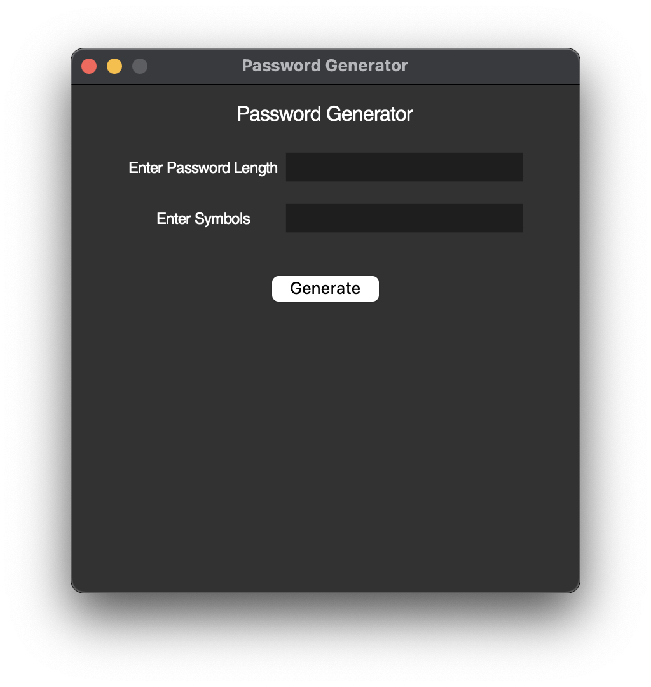
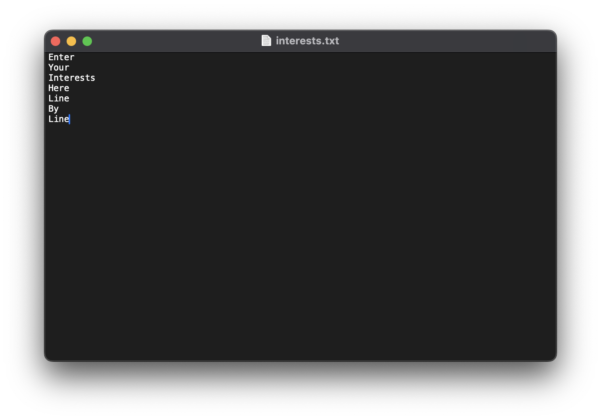
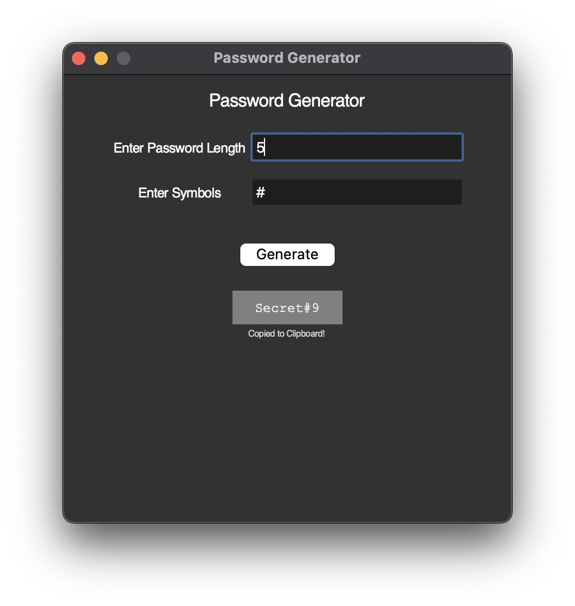

# Password Generator

A simple solution to making passwords

# How It Works

The program looks primarily at 3 things

1. A word of interest based on the user
2. The password desired length
3. The required/desired symbols

The password system required at lest one interest put in the system to work.

## Editing Interests

Go to `File` → `Edit Interests`

This will open up the built in file `interests.txt`

Interests are setup in line by line design

Enter your interests or password desired words one word at a time, then hit `File` → `Save` (or `⌘S` for Mac)

Go back to the Password Generator and hit `File` → `Refresh Interests` to updat the app.

When you enter your minimum length, special characters and click Generate a password will be generated in the bottom.

Left click on the password to add it to your clipboard

